# 🛒 온라인 쇼핑몰 API (online store API)

쇼핑몰 웹 사이트를 위한 REST API<br/>

<br/>

## 1. 제작 기간 & 참여 인원

- v1.0 : 2023년 11월 1일 ~ 2024년 1월 14일
- v1.1 : 2023년 3월 23일 ~ 2023년 3월 25일
- 개인 프로젝트

<br/>

## 2. 사용 기술

- Java 17
- Spring Boot 2.7.17
- Gradle 8.3
- Spring Data JPA
- QueryDSL
- MySQL
- H2
- Spring Security
- Spring Web
- Spring REST Docs
- restdocs-api-apec
- Google Cloud Platform

<br/>

## 3. ERD


<br/>

## 4. 기능

사용자는 Swagger 문서를 통해 쇼핑몰의 기능을 테스트할 수 있습니다.

<br/>

### 4.1. 전체 흐름

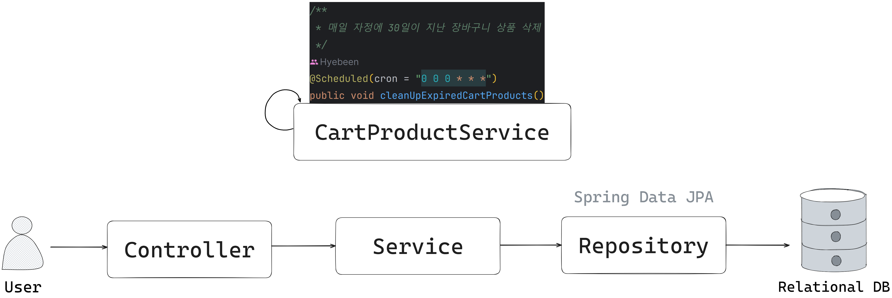<br/><br/>

<br/>

### 4.2. 전체 기능

- **관리자 (어드민)**
    - 상품 페이징/상세 조회, 상품 등록, 상품 정보 수정, 상품 이미지 변경
    - 주문 페이징/상세 조회, 주문 취소, 배송 상태 변경(상품 준비 중/배송 중/배송 완료 처리)
    - 카테고리 전체/상세 조회, 카테고리 추가/수정/삭제
    - 회원 페이징/상세 조회
- **일반 회원**
    - 배송지 전체/상세 조회, 배송지 추가/수정/삭제
    - 장바구니 조회, 장바구니에 상품 추가, 장바구니 상품 주문/수량 변경/삭제
    - 주문 페이징/상세 조회, 주문하기, 주문 취소
    - 회원 정보 조회/수정
- **홈 (권한이 필요 없음)**
    - 상품 페이징/상세/이미지 조회
    - 카테고리 전체 조회, 카테고리에 속한 상품 페이징 조회
    - 회원가입, 로그인/로그아웃

<br/>

### 4.3. 핵심 기능

대부분은 기본적인 로직이므로, 설명이 필요한 기능만을 기술하도록 하겠습니다.

<details>
<summary><b>상품 등록</b></summary>
<div markdown="1">

<br/>

**Controller**

- **Multipart 타입 요청** 📌 [코드 확인](https://github.com/hbeeni/online-store/blob/df624c3a7faea999576c10ea7fc57642562c6a71/src/main/java/com/been/onlinestore/controller/admin/AdminProductApiController.java#L55)
    - 상품 정보와 상품 이미지를 `Multipart` 타입으로 요청받습니다.

    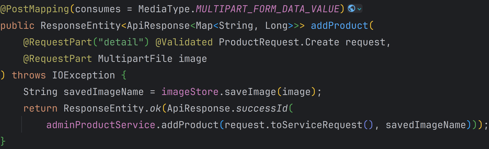

<br/>

- **상품 이미지 저장** 📌 [코드 확인](https://github.com/hbeeni/online-store/blob/df624c3a7faea999576c10ea7fc57642562c6a71/src/main/java/com/been/onlinestore/file/ImageStore.java#L59)
    - `UUID`를 사용해 이미지의 이름을 생성합니다.
    - 생성한 이름으로 이미지를 저장한 후 이름을 반환합니다.

    

<br/>

**Service & Repository**

📌 [코드 확인](https://github.com/hbeeni/online-store/blob/df624c3a7faea999576c10ea7fc57642562c6a71/src/main/java/com/been/onlinestore/service/admin/AdminProductService.java#L44)

- **판매 상태 체크**
    - 판매 상태(`saleStatus`)를 입력하지 않으면 자동으로 판매 대기(`WAIT`) 상태로 저장되게 합니다.

<br/>

- **DB 저장**
    - 이미지 저장, 판매 상태 체크가 끝난 상품은 엔티티를 생성한 후 DB에 저장합니다.
    - DB에 저장한 후 저장된 상품 엔티티의 ID를 반환합니다.

    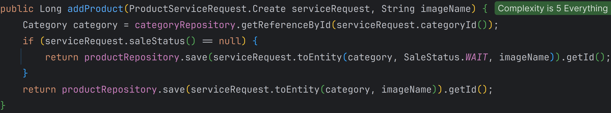

</div>
</details>

<details>
<summary><b>상품 주문</b></summary>
<div markdown="1">

<br/>

> 상품 주문은 두 가지 경우가 있습니다.
> 1. 상품을 바로 주문하는 경우 (= 한 상품을 주문하는 경우)
> 2. 장바구니에 담긴 상품을 선택해서 한 상품 또는 여러 상품을 주문하는 경우
>
> 상품을 바로 주문하는 경우로 설명하겠습니다.<br/>
> 장바구니에 담긴 상품을 주문하는 경우는 코드 링크를 남기겠습니다.

<br/>

**Controller**

> [장바구니 상품 주문 코드 확인](https://github.com/hbeeni/online-store/blob/df624c3a7faea999576c10ea7fc57642562c6a71/src/main/java/com/been/onlinestore/controller/CartApiController.java#L53)

<br/>

- **요청 처리** 📌 [코드 확인](https://github.com/hbeeni/online-store/blob/df624c3a7faea999576c10ea7fc57642562c6a71/src/main/java/com/been/onlinestore/controller/OrderApiController.java#L52)
    - 로그인한 유저와 상품 주문에 필요한 정보를 요청으로 받습니다.

    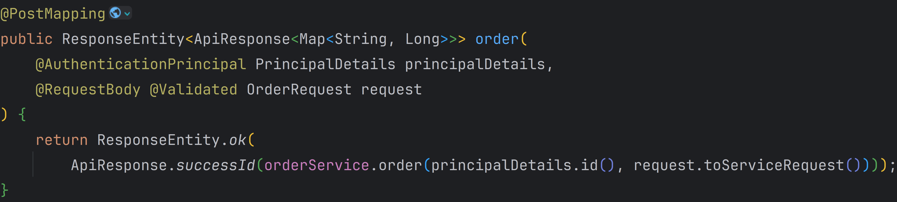

<br/>

**Service & Repository**

> [장바구니 상품 주문 코드 확인](https://github.com/hbeeni/online-store/blob/df624c3a7faea999576c10ea7fc57642562c6a71/src/main/java/com/been/onlinestore/service/CartProductService.java#L68)

<br/>

- **판매 중인지 검증** 📌 [코드 확인](https://github.com/hbeeni/online-store/blob/df624c3a7faea999576c10ea7fc57642562c6a71/src/main/java/com/been/onlinestore/service/OrderService.java#L54)
    - 주문한 상품이 현재 판매 중인지 검증합니다.
    - 상품이 현재 판매 중이고, 재고도 충분하다면 주문 엔티티를 생성합니다.

    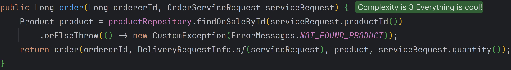

<br/>

- **상품 재고 감소** 📌 [코드 확인](https://github.com/hbeeni/online-store/blob/df624c3a7faea999576c10ea7fc57642562c6a71/src/main/java/com/been/onlinestore/domain/OrderProduct.java#L50)
	- 주문 상품 엔티티 생성 시 상품 재고를 감소시킵니다.
	- 상품의 재고가 부족하면 주문할 수 없습니다.
	- 상품의 재고가 0이 되면 판매 상태를 (`OUT_OF_STOCK`)으로 변경합니다.

    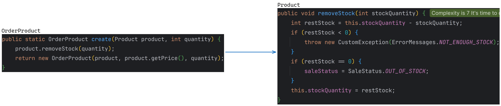

<br/>

- **DB 저장** 📌 [코드 확인](https://github.com/hbeeni/online-store/blob/df624c3a7faea999576c10ea7fc57642562c6a71/src/main/java/com/been/onlinestore/service/OrderService.java#L54)
    - 생성된 주문 & 주문 상품 엔티티를 DB에 저장합니다.
    - 저장된 주문 엔티티의 ID를 반환합니다.

</div>
</details>

<details>
<summary><b>상품 페이징 조회 (검색)</b></summary>
<div markdown="1">

- 관리자는 **카테고리 ID, 상품명, 상품 상태**로 검색할 수 있습니다.
- 일반 회원은 **상품명**으로 검색할 수 있습니다.
- 관리자 기준으로 설명하겠습니다.

<br/>

**Controller**

- **요청 처리** 📌 [코드 확인](https://github.com/hbeeni/online-store/blob/df624c3a7faea999576c10ea7fc57642562c6a71/src/main/java/com/been/onlinestore/controller/admin/AdminProductApiController.java#L42)
    - 상품 검색 조건과 페이지네이션 정보를 요청으로 받습니다.

    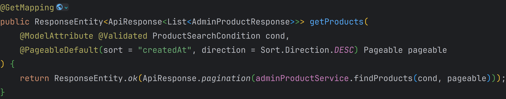

<br/>

**Service**

- **Repository 호출** 📌 [코드 확인](https://github.com/hbeeni/online-store/blob/df624c3a7faea999576c10ea7fc57642562c6a71/src/main/java/com/been/onlinestore/service/admin/AdminProductService.java#L34)
    - 단순히 Repository를 호출하기만 합니다.

    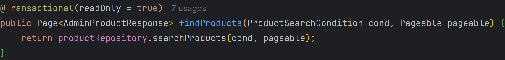

<br/>

**Repository**

> 조건문 재활용 및 가독성을 위해 QueryDSL을 사용합니다.

<br/>

- **Projection** 📌 [코드 확인](https://github.com/hbeeni/online-store/blob/df624c3a7faea999576c10ea7fc57642562c6a71/src/main/java/com/been/onlinestore/repository/querydsl/product/ProductRepositoryCustomImpl.java#L82)
	- Projection을 사용해 DTO에 결과를 매핑합니다.
	- 상품 이미지 경로는 `imageName` 앞에 `imagePath`를 붙입니다.

    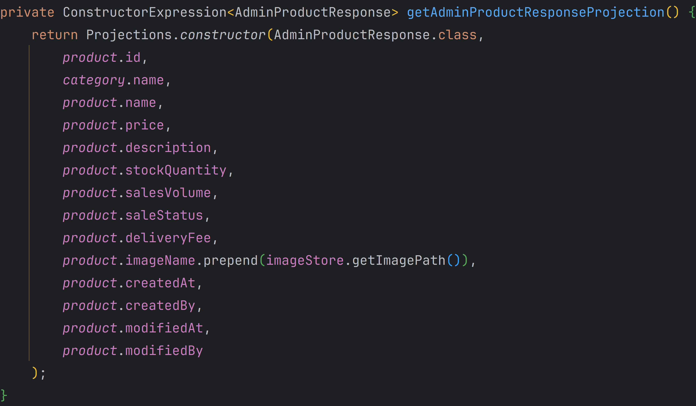
	
<br/>

- **상품 검색** 📌 [코드 확인](https://github.com/hbeeni/online-store/blob/df624c3a7faea999576c10ea7fc57642562c6a71/src/main/java/com/been/onlinestore/repository/querydsl/product/ProductRepositoryCustomImpl.java#L43)
    - QueryDSL을 사용하여 상품을 검색합니다.
	- `Pageable`의 `Sort`를 바로 사용할 수 없기 때문에 `OrderSpecifier`를 만들어줍니다. (`OrderSpecifier`에 관한 내용은 **5. 핵심 트러블 슈팅**에 있습니다.)

    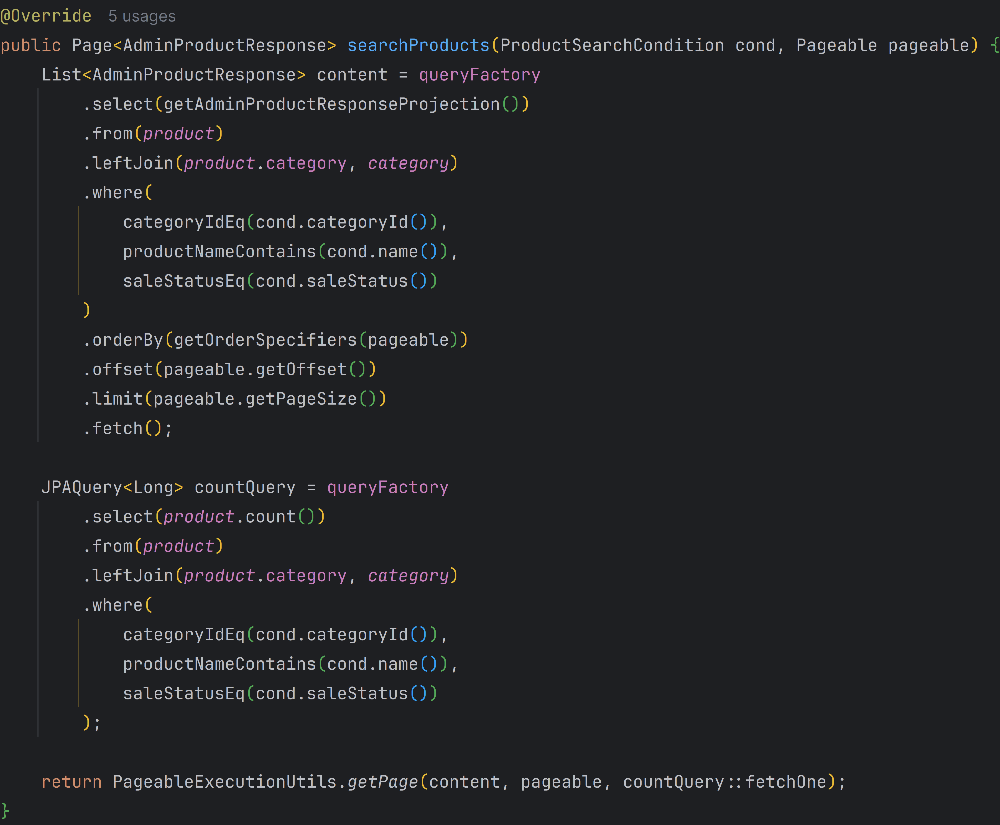

</div>
</details>

<details>
<summary><b>배송지 추가/수정/삭제</b></summary>
<div markdown="1">

- 배송지엔 **기본 배송지** 기능이 존재합니다.
- 기본 배송지가 아닌 배송지를 **일반 배송지**라고 칭하겠습니다.

<details>
<summary><b>배송지 추가</b></summary>
<div markdown="1">

<br/>

**Controller**

- **요청 처리** 📌 [코드 확인](https://github.com/hbeeni/online-store/blob/df624c3a7faea999576c10ea7fc57642562c6a71/src/main/java/com/been/onlinestore/controller/AddressApiController.java#L48)
    - 로그인한 유저와 추가할 배송지 정보를 요청으로 받습니다.

    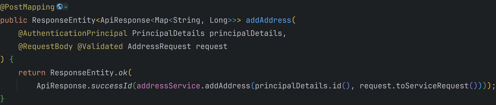

<br/>

**Service & Repository**

📌 [코드 확인](https://github.com/hbeeni/online-store/blob/df624c3a7faea999576c10ea7fc57642562c6a71/src/main/java/com/been/onlinestore/service/AddressService.java#L42)

- **기본 배송지 처리**
    - 기본 배송지를 추가하는 경우: 기존의 기본 배송지는 일반 배송지로 변경합니다.
    - 일반 배송지를 추가하는 경우: 기본 배송지가 존재하지 않으면 기본 배송지로 추가합니다.

<br/>

- **DB 저장**
    - 기본 배송지 설정이 끝난 배송지는 엔티티 생성 후 DB에 저장합니다.
    - 저장된 배송지 엔티티의 ID를 반환합니다.

    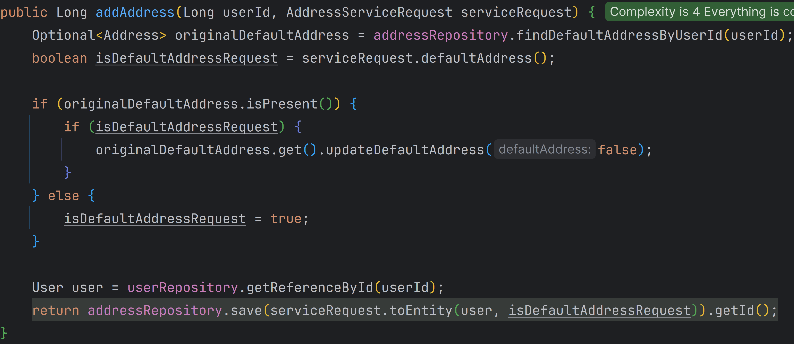

</div>
</details>

<details>
<summary><b>배송지 수정</b></summary>
<div markdown="1">

<br/>

**Controller**

- **요청 처리** 📌 [코드 확인](https://github.com/hbeeni/online-store/blob/df624c3a7faea999576c10ea7fc57642562c6a71/src/main/java/com/been/onlinestore/controller/AddressApiController.java#L57)
    - 로그인한 유저, 수정할 배송지 ID, 수정할 배송지 정보를 요청으로 받습니다.

    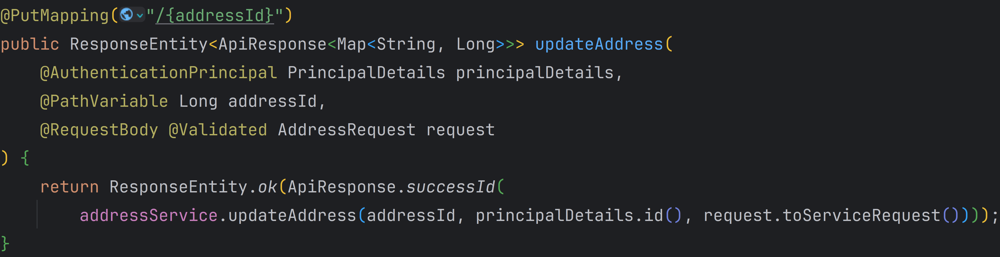

<br/>

**Service**

📌 [코드 확인](https://github.com/hbeeni/online-store/blob/df624c3a7faea999576c10ea7fc57642562c6a71/src/main/java/com/been/onlinestore/service/AddressService.java#L58)

- **기본 배송지 수정**
    - 현재 배송지를 기본 배송지로 수정한다면 기존의 기본 배송지는 일반 배송지로 수정합니다.

<br/>

- **Dirty Checking**
    - 수정한 배송지를 직접 save 하지 않고, dirty checking을 통해 자동으로 변경을 감지합니다.

<br/>

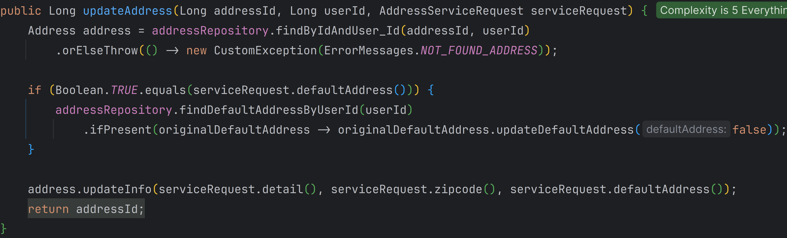

</div>
</details>

<details>
<summary><b>배송지 삭제</b></summary>
<div markdown="1">

<br/>

**Controller**

- **요청 처리** 📌 [코드 확인](https://github.com/hbeeni/online-store/blob/df624c3a7faea999576c10ea7fc57642562c6a71/src/main/java/com/been/onlinestore/controller/AddressApiController.java#L67)
    - 로그인한 유저, 삭제할 배송지 ID를 요청으로 받습니다.

    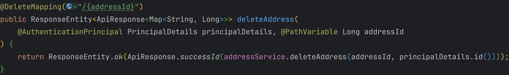

<br/>

**Service & Repository**

📌 [코드 확인](https://github.com/hbeeni/online-store/blob/df624c3a7faea999576c10ea7fc57642562c6a71/src/main/java/com/been/onlinestore/service/AddressService.java#L71)

- **기본 배송지 검증**
    - 기본 배송지는 삭제할 수 없습니다.

<br/>

- **DB 삭제**
    - 일반 배송지라면 DB에서 삭제합니다.

<br/>

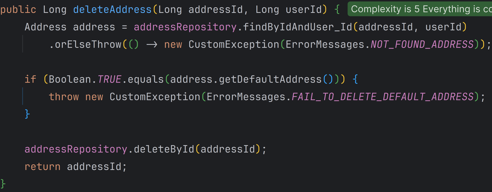

</div>
</details>

---

</div>
</details>

<details>
<summary><b>배송 상태 변경</b></summary>
<div markdown="1">

배송 상태 변경 순서는 다음과 같습니다.


<br/>

로직의 흐름은 동일하기 때문에 **상품 준비 중으로 변경하는 경우**를 기준으로 설명하겠습니다.

<br/>

**Controller**

- **요청 처리** 📌 [코드 확인](https://github.com/hbeeni/online-store/blob/df624c3a7faea999576c10ea7fc57642562c6a71/src/main/java/com/been/onlinestore/controller/admin/AdminOrderApiController.java#L46)
    - 배송 상태를 변경하려는 주문의 ID를 요청으로 받습니다.

    

<br/>

**Service**

- **상품 판매량 증가** 📌 [코드 확인](https://github.com/hbeeni/online-store/blob/df624c3a7faea999576c10ea7fc57642562c6a71/src/main/java/com/been/onlinestore/domain/Order.java#L104)
	- 상품 준비 중 처리 시 상품의 판매량을 증가시킵니다.
	- _cf) 배송 완료 처리 시에는 배송 엔티티(`Delivery`)의 `deliveredAt`에 현재 시간을 입력합니다. 📌 [코드 확인](https://github.com/hbeeni/online-store/blob/df624c3a7faea999576c10ea7fc57642562c6a71/src/main/java/com/been/onlinestore/domain/Delivery.java#L71)_

	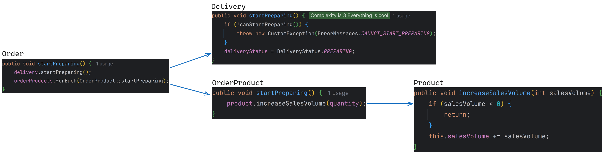

<br/>

- **상품 준비 처리** 📌 [코드 확인](https://github.com/hbeeni/online-store/blob/df624c3a7faea999576c10ea7fc57642562c6a71/src/main/java/com/been/onlinestore/service/admin/AdminOrderService.java#L39)
    - 배송 상태가 결제 완료(`ACCEPT`)인 경우에만 상품 준비 중으로 변경할 수 있습니다.
    - 수정한 주문을 직접 save 하지 않고, dirty checking을 통해 자동으로 변경을 감지합니다.

	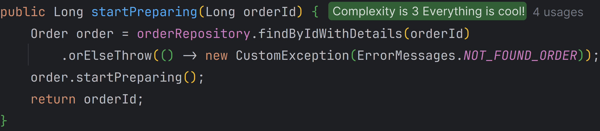

</div>
</details>

<details>
<summary><b>주문 취소</b></summary>
<div markdown="1">

- 관리자, 일반 회원 모두 주문을 취소할 수 있습니다.
- 일반 회원 기준으로 설명하겠습니다.

<br/>

**Controller**

- **요청 처리** 📌 [코드 확인](https://github.com/hbeeni/online-store/blob/df624c3a7faea999576c10ea7fc57642562c6a71/src/main/java/com/been/onlinestore/controller/OrderApiController.java#L61)
    - 로그인한 유저와 취소하려는 주문의 ID를 요청으로 받습니다.

    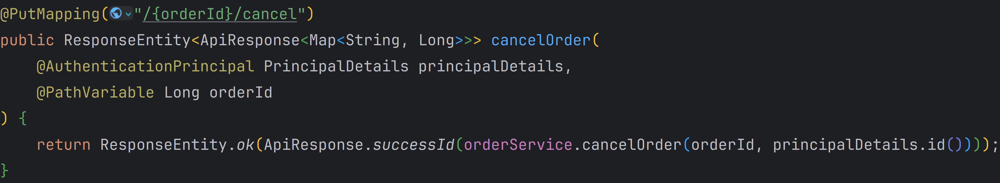

<br/>

**Service**

- **상품 재고 증가** 📌 [코드 확인](https://github.com/hbeeni/online-store/blob/df624c3a7faea999576c10ea7fc57642562c6a71/src/main/java/com/been/onlinestore/domain/Order.java#L96)
    - 주문 취소 시 해당 주문의 상품 재고를 증가시킵니다.
    - 만약 해당 상품이 품절 상태였다면 판매 중으로 변경합니다.
    
    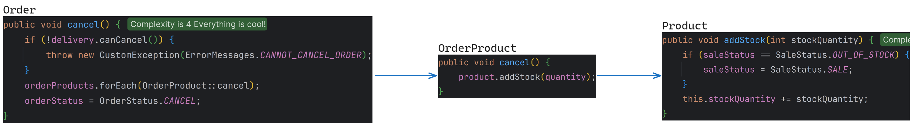

<br/>

- **주문 취소** 📌 [코드 확인](https://github.com/hbeeni/online-store/blob/df624c3a7faea999576c10ea7fc57642562c6a71/src/main/java/com/been/onlinestore/service/OrderService.java#L65)
    - 주문 상태가 `ORDER`인 경우에만 주문을 취소할 수 있습니다.
    - 취소한 주문은 DB에서 삭제하지 않고, 주문 상태(`OrderStatus`)를 취소(`CANCEL`)로 변경합니다.
    - 수정한 주문을 직접 save 하지 않고, dirty checking을 통해 자동으로 변경을 감지합니다.

    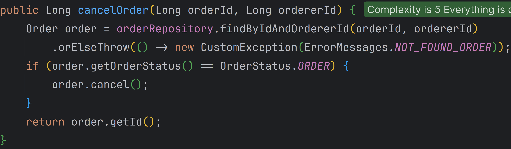

</div>
</details>

<details>
<summary><b>API 응답 형식 통일</b></summary>
<div markdown="1">

- 현재 서비스에서는 API 공통 응답 포맷을 사용하고 있습니다. 📌 [성공 응답](https://github.com/hbeeni/online-store/blob/df624c3a7faea999576c10ea7fc57642562c6a71/src/main/java/com/been/onlinestore/response/ApiResponse.java#L16) 📌 [에러 응답](https://github.com/hbeeni/online-store/blob/df624c3a7faea999576c10ea7fc57642562c6a71/src/main/java/com/been/onlinestore/response/ApiErrorResponse.java#L14)
- `Controller`에서는 `ApiResponse`를 반환합니다.
- 예외 발생 시 `GlobalExceptionHandler`에서 `ApiErrorResponse`를 반환합니다. 📌 [코드 확인](https://github.com/hbeeni/online-store/blob/df624c3a7faea999576c10ea7fc57642562c6a71/src/main/java/com/been/onlinestore/exceptionhandler/GlobalExceptionHandler.java#L24)

<br/>

- 그 외의 상황에도 공통 응답을 반환하기 위해 아래와 같이 구현하였습니다.

	- **로그인하지 않은 경우** 📌 [코드 확인](https://github.com/hbeeni/online-store/blob/df624c3a7faea999576c10ea7fc57642562c6a71/src/main/java/com/been/onlinestore/exceptionhandler/security/CustomAuthenticationEntryPoint.java#L17)

	    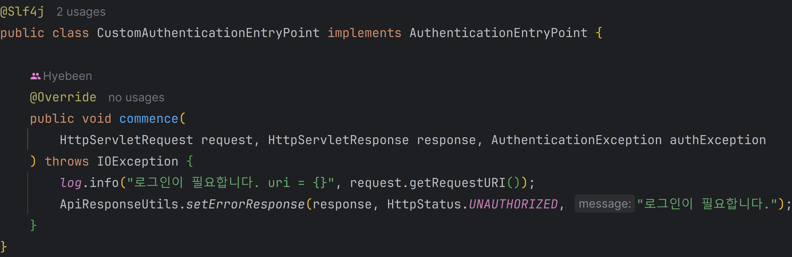

	<br/>

	- **로그인은 하였지만 해당 권한으로는 접근할 수 없는 경우** 📌 [코드 확인](https://github.com/hbeeni/online-store/blob/df624c3a7faea999576c10ea7fc57642562c6a71/src/main/java/com/been/onlinestore/exceptionhandler/security/CustomAccessDeniedHandler.java#L17)

	    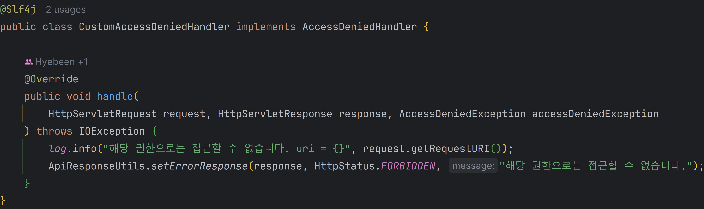

	<br/>

	- **로그아웃** 📌 [코드 확인](https://github.com/hbeeni/online-store/blob/df624c3a7faea999576c10ea7fc57642562c6a71/src/main/java/com/been/onlinestore/config/security/CustomLogoutSuccessHandler.java#L19)
		- Security 설정의 `logoutSuccessHandler`에 등록하였습니다.

        ```java
        http.logout(logout -> logout.logoutSuccessHandler(new CustomLogoutSuccessHandler()))
        ```

	    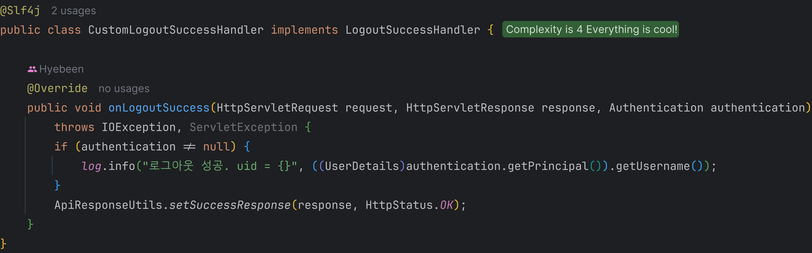

</div>
</details>

<br/>

## 5. 핵심 트러블 슈팅

### 5.1. QueryDSL 정렬 문제

- QueryDSL을 사용 시 정렬할 때는 `Pageable`의 `Sort`를 그대로 사용할 수 없습니다.
- `orderBy` 메서드의 파라미터로 `OrderSpecifier` 타입이 필요하기 때문입니다.
  
    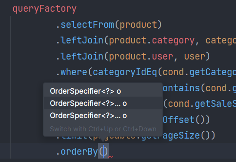

- 따라서 `Pageable`의 `Sort` 정보를 토대로 `OrderSpecifier`를 생성해주었습니다.

<details>
<summary><b>코드</b></summary>
<div markdown="1">

```java
private OrderSpecifier[] getOrderSpecifiers(Pageable pageable) {
    List<OrderSpecifier> orderSpecifiers = getOrderSpecifiers(pageable.getSort());
    return orderSpecifiers.toArray(OrderSpecifier[]::new);
}

private List<OrderSpecifier> getOrderSpecifiers(Sort sort) {
    List<OrderSpecifier> orderSpecifiers = new ArrayList<>();
    sort.stream().forEach(order -> {
                Order direction = order.isAscending() ? Order.ASC : Order.DESC;
                String property = order.getProperty();
                PathBuilder<Product> pathBuilder = new PathBuilder<>(Product.class, "product");
                orderSpecifiers.add(new OrderSpecifier(direction, pathBuilder.get(property)));
            }
    );

    return orderSpecifiers;
}
```

```java
@Override
	public Page<AdminProductResponse> searchProducts(ProductSearchCondition cond, Pageable pageable) {
		List<AdminProductResponse> content = queryFactory
			.select(getAdminProductResponseProjection())
			.from(product)
			.leftJoin(product.category, category)
			.where(
				categoryIdEq(cond.categoryId()),
				productNameContains(cond.name()),
				saleStatusEq(cond.saleStatus())
			)
			.orderBy(getOrderSpecifiers(pageable))
			.offset(pageable.getOffset())
			.limit(pageable.getPageSize())
			.fetch();
        
        //...
	}
```

</div>
</details>

<br/>

### 5.2. fetch join과 페이징을 함께 사용 시 count query 생성 오류 문제

- 페이징을 하기 위해서는 전체 카운트가 꼭 있어야 몇 페이지까지 있는지 알 수 있습니다.
- 그래서 `countQuery`가 없으면 Spring Data JPA가 원본 쿼리를 보고 임의로 `countQuery`를 생성합니다.
- 그런데 기존 코드에서 `QueryException: query specified join fetching, but the owner of the fetched association was not present in the select list` 에러가 발생했습니다.

<details>
<summary><b>기존 코드</b></summary>
<div markdown="1">

```java
@Query("select p from Product p join fetch p.category where p.saleStatus = 'SALE'")
Page<Product> findAllOnSale(Pageable pageable);
```

</div>
</details>

- 원래는 `countQuery`를 제대로 만들어 주는데, 페이징 시에는 `fetch join`이 포함되게 만들어주기 때문에 오류가 발생합니다.
- `fetch join`은 엔티티 상태에서 엔티티 그래프를 참조하기 위해서 사용하는데, `count()`로 조회 결과가 변경되어버렸기 때문입니다.
- `countQuery`를 직접 작성함으로써 오류를 해결했습니다.

_cf) `fetch join`이나 복잡한 쿼리의 경우 꼭 `countQuery`를 작성해야 한다고 합니다._

<details>
<summary><b>개선된 코드</b></summary>
<div markdown="1">

```java
@Query(value = "select p from Product p join fetch p.category where p.saleStatus = 'SALE'",
        countQuery = "select count(p) from Product p where p.saleStatus = 'SALE'")
Page<Product> findAllOnSale(Pageable pageable);
```

</div>
</details>

<br/>

### 5.3. Spring REST Docs만 사용할 시 API Test를 할 수 없는 문제

- API 문서를 만들기 위해 Spring REST Docs를 사용하였습니다.
- 비즈니스 코드에 영향을 주지 않고, 테스트도 강제하여 신뢰성 높은 API 문서를 만들 수 있기 때문에 해당 기술을 선택하였습니다.

<br/>

- 그런데 Spring REST Docs를 사용하면 API Test가 불가능했습니다.
- 이 서비스는 API 문서만을 제공하므로 Swagger를 사용할 때처럼 API를 테스트할 수 있는 기능을 갖추었으면 했습니다.
- 따라서 API Test도 가능하게끔 restdocs-api-spec과 Swagger UI 정적 파일을 사용하였습니다.

1. Swagger UI 파일을 수정합니다.
	- `index.html` 파일의 내부 css, js 경로를 수정합니다.
	- `swagger-initializer.js` 파일의 SwaggerUIBundle 경로는 OpenAPI Specification(OAS) 파일 경로로 수정합니다.
2. Spring REST Docs + restdocs-api-spec로 테스트를 작성합니다.
3. restdocs-api-spec으로 OAS 파일 생성 후 static 디렉토리로 복사합니다.
4. Swagger UI 정적 파일로 생성된 OAS 파일을 엽니다.

<details>
<summary><b>코드</b></summary>
<div markdown="1">

예시) [ProductControllerTest](/src/test/java/com/been/onlinestore/controller/ProductApiControllerTest.java) 중 상품 조회 테스트입니다.<br/>
예시처럼 테스트를 작성하였습니다.

```java
@DisplayName("[API][GET] 상품 조회")
@Test
void test_getProducts() throws Exception {
	//Given
	int pageNumber = 0;
	int pageSize = 20;
	String sortName = "createdAt";

	CategoryProductResponse response = CategoryProductResponse.of(
		1L,
		"채소",
		"깐대파 500g",
		4500,
		"시원한 국물 맛의 비밀",
		SaleStatus.SALE,
		3000,
		imagePath + "c1b2f2a2-f0b8-403a-b03b-351d1ee0bd05.jpg"
	);

	Pageable pageable = PageRequest.of(pageNumber, pageSize, Sort.by(Sort.Order.desc(sortName)));
	Page<CategoryProductResponse> page = new PageImpl<>(List.of(response), pageable, 1);

	given(productService.findProductsOnSale(null, pageable)).willReturn(page);

	//When & Then
	mvc.perform(
			get("/api/products")
				.queryParam("page", String.valueOf(pageNumber))
				.queryParam("size", String.valueOf(pageSize))
				.queryParam("sort", sortName + ",desc")
		)
		.andExpect(status().isOk())
		.andExpect(content().contentTypeCompatibleWith(MediaType.APPLICATION_JSON))
		.andExpect(jsonPath("$.status").value("success"))
		.andExpect(jsonPath("$.data").isArray())
		.andExpect(jsonPath("$.data[0].id").value(response.id()))
		.andExpect(jsonPath("$.data[0].name").value(response.name()))
		.andExpect(jsonPath("$.data[0].price").value(response.price()))
		.andExpect(jsonPath("$.page.number").value(page.getNumber()))
		.andExpect(jsonPath("$.page.size").value(page.getSize()))
		.andExpect(jsonPath("$.page.totalPages").value(page.getTotalPages()))
		.andExpect(jsonPath("$.page.totalElements").value(page.getTotalElements()));
	then(productService).should().findProductsOnSale(null, pageable);
}
```
<br/>

- `openapi3` task로 OAS 파일을 생성하였습니다.
- OAS 파일을 열기 위해 `copyOpenApiYaml` task로 생성된 OAS 파일을 static 디렉토리에 복사하였습니다.

```groovy
openapi3 {
    server = 'http://onlinestoreapi.kro.kr'
    title = '쇼핑몰 API'
    description = '쇼핑몰 API 입니다'
    version = '1.0.0'
    format = 'yaml'
}

tasks.register('copyOpenApiYaml', Copy) {
    dependsOn 'processResources'
    dependsOn 'openapi3'

    def dir = "src/main/resources/static/docs"

    new File("${dir}/openapi3.yaml").delete()
    from("${openapi3.outputDirectory}")
    into(dir)
}

bootJar {
    dependsOn 'copyOpenApiYaml'
}
```

<br/>

빌드 후 서버를 띄우면 API 테스트가 가능한 Swagger API 문서를 볼 수 있었습니다.

</div>
</details>

</br>

## 6. 그 외 트러블 슈팅

<details>
<summary>[홈] 카테고리 전체 조회 API - 판매하는 상품이 없는 카테고리까지 조회되는 문제</summary>
<div markdown="1">

- 홈에서는 판매하는 상품이 있는 카테고리만 조회되어야 함
- 판매하는 상품이란? **판매 중**이거나 **품절**인 상품
- 해결: `findAll()` 대신 아래 메서드를 사용

```java
@Query("select distinct c from Category c "
	+ "join c.products p "
	+ "where p.saleStatus = 'SALE' or p.saleStatus = 'OUT_OF_STOCK'")
List<Category> findAllBySellingProducts();
```

</div>
</details>

<details>
<summary>[홈] 상품 조회 API - 품절 상품은 조회되지 않는 문제</summary>
<div markdown="1">

- 문제: 홈에서 상품 조회 시 판매 중이거나 품절인 상품이 조회되어야 하는데 판매 중인 상품만 조회됨
- 해결: `SaleStatus`가 `SALE`, `OUT_OF_STOCK`인 상품을 조회

    `where p.saleStatus = 'SALE' or p.saleStatus = 'OUT_OF_STOCK'`

</div>
</details>

<details>
<summary>[어드민] 상품 등록 API - <code>sale_status</code> 칼럼에 <code>null</code>이 들어가는 문제</summary>
<div markdown="1">

- 문제: 상품 등록 시 판매 상태를 입력하지 않으면 `sale_status` 칼럼에 기본값(`WAIT`)이 아닌 `null`이 들어감
- 해결: 상품 등록 시 `SaleStatus`가 `null`일 경우 `WAIT`으로 엔티티를 생성함

    ```java
    public Long addProduct(ProductServiceRequest.Create serviceRequest, String imageName) {
		Category category = categoryRepository.getReferenceById(serviceRequest.categoryId());
		
		if (serviceRequest.saleStatus() == null) { //추가
			return productRepository.save(serviceRequest.toEntity(category, SaleStatus.WAIT, imageName)).getId();
		}
		
		return productRepository.save(serviceRequest.toEntity(category, imageName)).getId();
	}
    ```

</div>
</details>

<details>
<summary>[어드민] 주문 페이징 조회 API - 주문이 중복 검색되는 문제</summary>
<div markdown="1">

- 문제: count query 실행 시 주문이 아닌 주문 상품의 개수가 출력됨<br/>
    `queryFactory.selectDistinct(order.count())`

- 해결: `countDistinct()` 사용

```java
public Page<Order> findOrdersForAdmin(OrderSearchCondition cond, Pageable pageable) {
    List<Order> orders = findOrders(cond, pageable);

    JPAQuery<Long> countQuery = queryFactory
        .select(order.countDistinct()) //
        .from(order)
        .join(order.orderer, user)
        .join(order.deliveryRequest, deliveryRequest)
        .join(order.orderProducts, orderProduct)
        .join(orderProduct.product, product)
        .where(
            ordererIdEq(cond.ordererId()),
            productIdEq(cond.productId()),
            deliveryStatusEq(cond.deliveryStatus()),
            orderStatusEq(cond.orderStatus())
        );

    return PageableExecutionUtils.getPage(orders, pageable, countQuery::fetchOne);
}
```

</div>
</details>

<details>
<summary>장바구니 상품을 쿠키에 담을 때 발생한 문제</summary>
<div markdown="1">

- 문제: 쿠키는 브라우저별로 동작하기 때문에 다른 브라우저에서는 장바구니를 확인할 수 없었음

- 해결: 장바구니 상품을 데이터베이스에 저장함 ([ERD 참고](/document/online-store-erd.png))
- 향후 Redis에 저장하면 좋을 것 같음

</div>
</details>

<details>
<summary>DB에 장바구니 상품이 영구적으로 저장되는 문제</summary>
<div markdown="1">

- 문제
	- 장바구니 상품은 상품을 주문하는 경우에만 DB에서 삭제됨
	- 따라서 상품을 주문하지 않는다면 DB에 영구적으로 저장되는 상황이 발생함
	- 장바구니 상품이 영구적으로 DB에 저장되는 건 DB 리소스 낭비라고 생각됨
- 해결
	- `Scheduler`를 사용해 장바구니 상품의 `modifiedAt` 기준 30일이 지나면 장바구니 상품을 삭제함
	- 해당 작업은 매일 자정에 실행

    ```java
    @Scheduled(cron = "0 0 0 * * *")
	public void cleanUpExpiredCartProducts() {
		LocalDateTime thirtyDaysAgo = LocalDateTime.now().minusDays(30);

		List<CartProduct> expiredCartProducts = cartProductRepository.findAllByModifiedAtBefore(thirtyDaysAgo);

		List<Long> expiredCartProductIds = expiredCartProducts.stream()
			.map(CartProduct::getId)
			.toList();

		cartProductRepository.deleteAllByIdInBatch(expiredCartProductIds);
	}
    ```

</div>
</details>

<details>
<summary>아무나 관리자로 가입할 수 있는 문제</summary>
<div markdown="1">

- 문제: 회원가입 시 권한을 입력하기 때문에 아무나 관리자 권한으로 가입할 수 있음
- 해결
	- 최초 한 명의 관리자 회원만 DB에 직접 저장
	- 회원 가입 요청으로는 일반 회원 권한으로만 가입할 수 있게 변경

</div>
</details>

<details>
<summary>회원가입 시 익명 유저가 넘어오는 문제</summary>
<div markdown="1">

- 해결: 회원가입 시 `AnonymousAuthenticationToken`을 필터링함

```java
@Bean
public AuditorAware<String> auditorAware() {
    return () -> Optional.ofNullable(SecurityContextHolder.getContext())
            .map(SecurityContext::getAuthentication)
            .filter(Authentication::isAuthenticated)
            .filter(authentication -> !(authentication instanceof AnonymousAuthenticationToken)) //추가
            .map(Authentication::getPrincipal)
            .map(PrincipalDetails.class::cast)
            .map(PrincipalDetails::getUsername);
}
```

</div>
</details>

<details>
<summary>HttpMediaTypeNotSupportedException: Content type 'application/octet-stream' not supported</summary>
<div markdown="1">

- 문제: Swagger로 API 테스트 시 `Multipart` 타입으로 받으려고 하는 데이터가 `application/octet-stream` 타입으로 넘어와서 오류가 발생함
- 해결: `application/octet-stream` 타입을 받을 수 있도록 컨버터 생성

    ```java
    @Component
    public class MultipartJackson2HttpMessageConverter extends AbstractJackson2HttpMessageConverter {

        /**
        * "Content-Type: multipart/form-data" 헤더를 지원하는 HTTP 요청 변환기
        */
        public MultipartJackson2HttpMessageConverter(ObjectMapper objectMapper) {
            super(objectMapper, MediaType.APPLICATION_OCTET_STREAM);
        }

        @Override
        public boolean canWrite(Class<?> clazz, MediaType mediaType) {
            return false;
        }

        @Override
        public boolean canWrite(Type type, Class<?> clazz, MediaType mediaType) {
            return false;
        }

        @Override
        protected boolean canWrite(MediaType mediaType) {
            return false;
        }
    }
    ```

</div>
</details>

<details>
<summary>OAS 파일 생성 시 <code>RequestPart</code>를 사용하는 부분은 누락되는 문제</summary>
<div markdown="1">

- 문제: restdocs-api-spec으로 OAS 파일 생성 시 `@RequestPart`에 관련된 부분이 누락됨

- 해결: 빠진 부분을 수동으로 추가할 수 있게 build script를 작성함 📌 [코드 확인](https://github.com/hbeeni/online-store/blob/df624c3a7faea999576c10ea7fc57642562c6a71/build.gradle#L49)

    ```groovy
    tasks.register('insertToOpenApiYaml') {
        dependsOn 'processResources'
        dependsOn 'openapi3'

        doLast {
            def filePath = "${openapi3.outputDirectory}/openapi3.yaml"

            def openApiFile = file(filePath)
            def content = openApiFile.text

            def dir = "src/main/resources/static/insert-to-yaml"
            def addProductText = file("${dir}/add-product.txt").text
            def updateProductImageText = file("${dir}/update-product-image.txt").text

            def insertionPoint1 = content.indexOf("operationId: admin/product/addProduct") +
                    "operationId: admin/product/addProduct".length()
            def insertionPoint2 = content.indexOf("operationId: admin/product/updateProductImage") +
                    "operationId: admin/product/updateProductImage".length()

            def section1 = content.substring(0, insertionPoint1) + "\n"
            def section2 = content.substring(insertionPoint1, insertionPoint2) + "\n"
            def section3 = content.substring(insertionPoint2)

            def newContent =
                    new StringBuilder().append(section1).append(addProductText)
                            .append(section2).append(updateProductImageText)
                            .append(section3)

            new File(filePath).write(newContent.toString(), "utf-8")
        }
    }
    ```

</div>
</details>

<details>
<summary>MySQL connection timed out 문제</summary>
<div markdown="1">

- 문제 상황
	- GCP를 이용해 배포 후 발생한 문제임
	- Spring Boot Application VM 인스턴스, MySQL VM 인스턴스를 각각 생성함
	- MySQL VM 인스턴스에 MySQL 설치하고, localhost 계정 생성도 했는데 연결이 되지 않았음
- 해결
	- MySQL을 로컬이 아닌 외부에서 IP를 통해 접속하려면 `bind-address`를 수정해야 함
    1. MySQL VM 인스턴스에 접속
    2. `etc/mysql/mysql.conf.d/mysqld.cnf` 파일의 `bind-address=0.0.0.0`으로 변경 후 MySQL 재시작
    3. MySQL에 모든 IP에서의 접근을 허용하게 접근을 `%`로 지정한 유저 생성

</div>
</details>

<details>
<summary>ssh: connect to host {IP} port 22: Connection timed out</summary>
<div markdown="1">

- 로컬에서 GCP VM 인스턴스에 SSH 접속을 시도할 때 문제가 발생함
- 해결: GCP 방화벽 규칙에서 22번 포트를 열어줌

</div>
</details>


